# The <i>R</i>-amones. Statistical Autopsy of A Punk Band
Salvino A. Salvaggio, PhD  
March 6th, 2017  

&nbsp;

**The starting point of this post is a simple question**: can we use *R* to analyze punk bands ? And, as a result: what can we learn from applying *data analytics methods* to punk music ?

Whether we like it or not "[punk rock is arguably the most important subgenre of music to come out of the ‘70s](http://loudwire.com/15-greatest-punk-bands-of-all-time/)" and consequently still an integral part of our mainstream contemporary culture. After years of being declared [too outrageous to be accepted](https://www.nyu.edu/pubs/counterblast/punk.htm), its legacy is so astonishingly [extensive](http://www.academia.edu/7012948/Punk_Rock_So_What_The_Cultural_Legacy_of_Punk) that it deserves careful consideration and serious attention. Since decades, many music critiques, fine arts experts, social and political scientists or historians of pop culture have devoted time and energy to study the punk scene, its cultural production and legacy, the attitude of the punk generation, its tangle of ideologies, the ways it was perceived and received. Facts and figures, however, are still missing, perhaps because there apparently is nothing more distant from *data analytics* than punk music. So, is *data analytics* of punk rock possible ? Would it make any sense ? My answer is a loud and bold **yes** --yes, statistics on punk rock matters.

&nbsp;

Although the [punk scene](http://rateyourmusic.com/list/BrainToad/top_100_punk_bands_as_voted_by_musicianforums_com_punk_forum_users/) cannot be condensed into a single band, the *Ramones* are still considered by many as the first "pure punk band" and, perhaps --and more importantly--, [one of the most influential](http://ppcorn.com/us/2015/12/16/the-top-ten-most-influential-punk-bands-ever/). This does not imply that other punk rock bands (Clash, Dead Kennedys, The Stooges, Misfits, Sex Pistols, Social Distorsion, Patti Smith Group, etc) are less noteworthy or not as good. Yet, since I need to start somewhere, I decided that my first attempt would focus on the [Ramones](https://en.wikipedia.org/wiki/Ramones) --which I paradoxically like a lot despite being more of a baroque and classical music person.

&nbsp;

### What did the Ramones do ?

From 1976 to 1994, the Ramones released [14 studio albums](https://en.wikipedia.org/wiki/Ramones_discography). In their original USA release, the albums comprised 176 different songs in total that were quite short (median: 2M 32S) and mostly written in a *Major* key (only 2 songs are in a *minor* key: Em).

| Year|Album               | Nbre of Songs|  Length|
|----:|:-------------------|-------------:|-------:|
| 1976|Ramones             |            14| 28M 52S|
| 1977|Leave Home          |            14| 28M 57S|
| 1977|Rocket To Russia    |            14|  28M 5S|
| 1978|Road To Ruin        |            12|  28M 9S|
| 1980|End Of The Century  |            12| 28M 50S|
| 1981|Pleasant Dreams     |            12| 28M 53S|
| 1983|Subterranean Jungle |            12| 28M 21S|
| 1985|Too Tough To Die    |            12| 28M 18S|
| 1986|Animal Boy          |            12| 28M 44S|
| 1987|Halfway To Sanity   |            12| 28M 53S|
| 1989|Brain Drain         |            12|  28M 2S|
| 1992|Mondo Bizarro       |            13| 28M 25S|
| 1993|Acid Eaters         |            12|  28M 3S|
| 1994|Adios Amigos        |            13|  28M 1S|

&nbsp;

Musical purists always reproached the Ramones for knowing a couple of chords only and making an excessive use of them. Data show that the band knew at least... 11 different chords (out of too-many-to-bother-counting possibilities) although 80% of their songs were built on no more than 6. And there is no evidence of a sophistication of the Ramones' compositions over time.

&nbsp;

Just as the number of different chords in a Ramones' song is independent from the song writer/s --t.test of *number of different chords ~ writers* don't allow to exclude alternative hypothesis--, even with each band member having a very distinct personality, according to the biographers.

&nbsp;

In terms of *official charts* ranking in the USA, the success of the Ramones fluctuated over their career. The first years of the band were definitely the most successful, from the creation of the band till the early 80's. Then, from 1985 onwards, it looks like that the sales didn't follow the strengthening of their reputation not only within but also outside the punk rock scene.

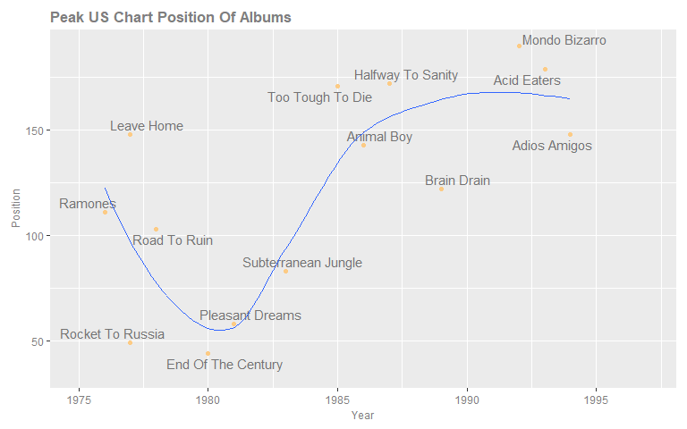

&nbsp;

### What did the Ramones say ?

Im my dataset, the Ramones' lyrics come from [azlyrics.com](http://www.azlyrics.com/r/ramones.html). I preferred this source over many other available sources since that website provides the lyrics without the verses repeats, which, in my opinion, would over-emphasise and, ultimately, biais the relevance of n-grams or topics. The dataset (a data frame) contains a *lyrics* variable, i.e. a character string of the track (without the verses repeats) including the *< br>* tags to mark the end of each line.

An example of the *lyrics* variable is like the following:

> *Hey ho, let s go < br>Hey ho, let s go < br>They re forming in a straight line < br>They re going through a tight wind < br>The kids are losing their minds < br>The Blitzkrieg Bop < br>They re piling in the back seat < br>They re generating steam heat < br>Pulsating to the back beat < br>The Blitzkrieg Bop. < br>Hey ho, let s go < br>Shoot em in the back now < br>What they want, I dont know < br>They re all reved up and ready to go*

Tidying the text up (adopting the data principles recommended by [Hadley Wickham](https://www.jstatsoft.org/article/view/v059i10)) is the necessary first step of the lyrics mining exercise. For that, I follow the *tidy text* approach developed by [Julia Silge & David Robinson](http://tidytextmining.com/index.html).

&nbsp;

First and foremost, it is worth noting that whatever the Ramones say, they say it in very few words ! Ramones songs are brief in time, but also short in lyrics (but not so much in vocabulary with 2,139 different unique words in total).

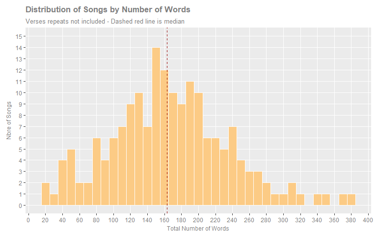

&nbsp;

Whereas uniGrams are usually considered suitable for analysis after expurgation of *stop words*, in the Ramones lyrics the raw uniGrams show an interesting pattern. The 2 most frequent words in the 14 studio albums are **i** and **you**. One could provocatively argue that *[Tea for Two](https://www.youtube.com/watch?v=y0zc7x434Aw)*, a well-known 1925 song from Vincent Youmans and Irving Caesar, is a good representation of the Ramones musical universe that seems to be mainly centered on *you* and *i*, and *i* and *you* !

In the uniGrams table below, the columns of the cleaned uniGrams highlight that the top word in the Ramones lyrics is *dont*, expressing an atmosphere of clear *negation*. But there is also a fascinating tension pointing to the future that shows through words such as *wanna*, *gonna* and *ll* (*will* or *shall*). *Rock* and *punk* amongst the top 20 words definitely remind you what type of music you are listening to but also what subculture the band belongs to. In an all-men band, words such as *baby*, *love*, *girl* witness the significance of man-woman relationships in the Ramones songs. Perhaps it took statistical analysis of lyrics to take the risk of forming the hypothesis of the Ramones as a romantic band...

|All uniGrams | Freq|   |&#124; |   |Cleaned uniGrams | Freq|
|:------------|----:|:--|:------|:--|:----------------|----:|
|i            | 1510|   |&#124; |   |dont             |  317|
|you          |  800|   |&#124; |   |baby             |  241|
|the          |  773|   |&#124; |   |yeah             |  161|
|a            |  615|   |&#124; |   |love             |  154|
|to           |  584|   |&#124; |   |wanna            |  122|
|s            |  498|   |&#124; |   |gonna            |  117|
|and          |  438|   |&#124; |   |time             |   90|
|it           |  402|   |&#124; |   |ll               |   78|
|my           |  372|   |&#124; |   |life             |   61|
|me           |  322|   |&#124; |   |rock             |   58|
|dont         |  317|   |&#124; |   |day              |   57|
|oh           |  259|   |&#124; |   |girl             |   55|
|in           |  258|   |&#124; |   |hey              |   55|
|of           |  251|   |&#124; |   |remember         |   54|
|baby         |  241|   |&#124; |   |punk             |   52|
|t            |  237|   |&#124; |   |ve               |   52|
|m            |  232|   |&#124; |   |world            |   48|
|no           |  215|   |&#124; |   |fun              |   43|
|can          |  202|   |&#124; |   |feel             |   42|
|on           |  200|   |&#124; |   |bad              |   41|
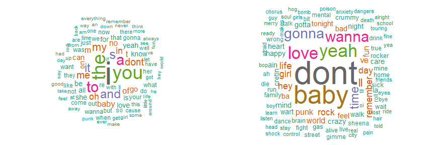

&nbsp;

The identification of **most frequent uniGrams per album** is a further step into a more granular analysis:

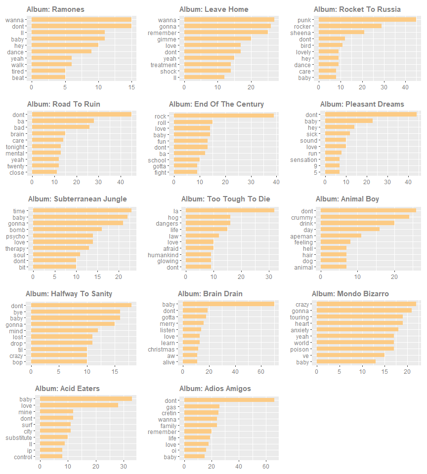

&nbsp;

In addition to identifying the most frequent single words, we could also highlight *when* they are used in the discography using a simple *Token Distribution Analysis*. Let's limit this exercise to 5 words only from the list of the top 20: *love*, *gonna*, *rock* (or *rocker*), *life* and *dont*.

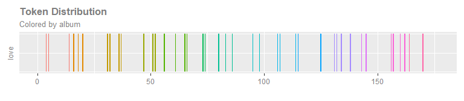
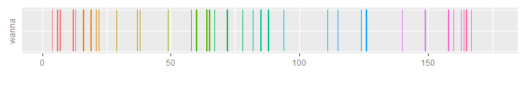

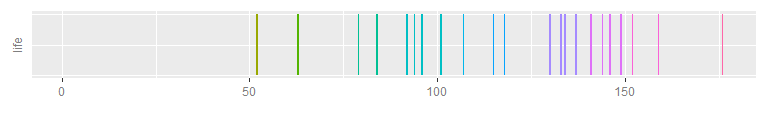
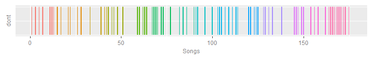

&nbsp;

A quick visualisation of 'raw' nGrams (*stop words* not removed) confirms the feeling of a narrative universe mainly focused on **i**, **you** and **negation** (*don't*).

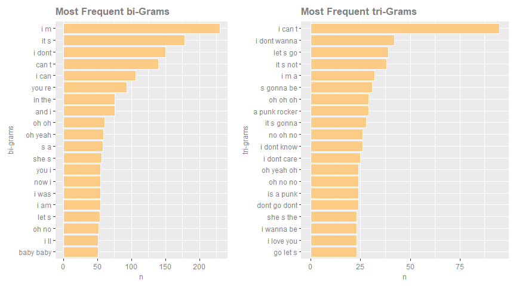

&nbsp;

### What did the Ramones feel ?

As a (brief) final chapter of this post, I would like to run a very quick --and limited-- *sentiment analysis* of the Ramones' studio albums lyrics. Actually, rather than a *sentiment analysis*, this is nothing but scratching the surface of *sentiment analysis*. The *bing* sentiment lexicon was used here, but a similar analysis could be carried out using *afinn* or *nrc* lexicons (all available in the *tidytext* r package) or using all of them for a comparative approach.

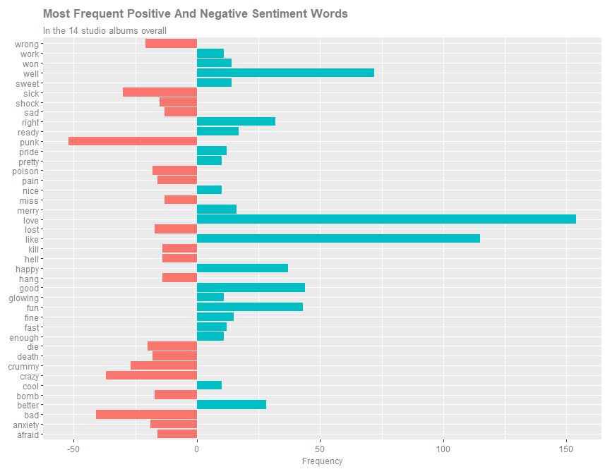

&nbsp;

Although the *sentiment lexicon* gives the word *punk* a negative value, there is little risk in asserting that this is not the way the Ramones intended it.

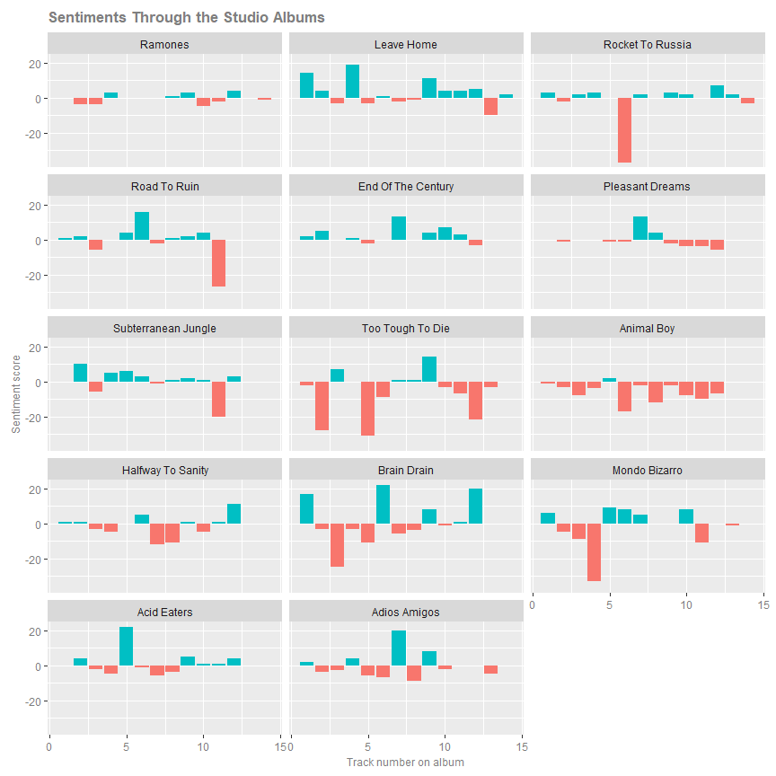

In order to fine tune the approach, a more accurate *sentiment analysis* should be undertaken paying attention to 4 *caveats* at least:

* in the lyrics, identify the sentiment words preceded or followed by *not*;
* review and, perhaps, amend the sentiment lexicon(s) to better reflect the *punk rock* subculture;
* focus on relative more than absolute frequencies of words;
* add terms' *inverse document frequency* analysis to measure the impact of the words that are rarely used.

&nbsp;

The **dataset** and **complete R code** of this post can be downloaded from this [link](http://www.salvaggio.net/_sasR/downloadsR/TheRamones_2017.zip).

